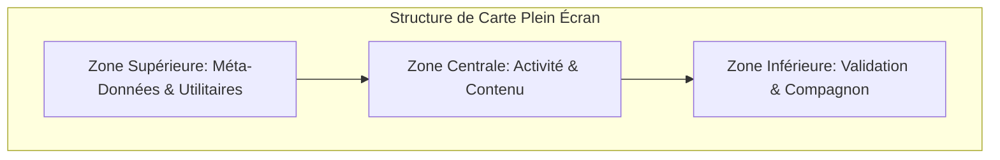

# Concept UX & Visuel : Intellia Flow

Ce document définit la direction UX/UI théorique pour le futur **Intellia Flow**, un flux d'apprentissage vertical plein écran conçu pour stimuler les adolescents tout en évitant le défilement passif addictif.

---

## 1. Philosophie et Objectif Produit

L'Intellia Flow transpose les codes d'interaction appréciés des adolescents (balayage vertical, immersion plein écran, contenus courts) dans un cadre purement pédagogique.
* **Le but** : Rendre l'apprentissage quotidien fluide et gratifiant pendant les grandes vacances.
* **Le principe** : Une session d'étude quotidienne structurée sous forme de **"Mission du jour"** composée de **10 cartes actives** (pas de défilement infini).
* **Le ton** : Pédagogique, ludique, et premium (Didot pour les titres de questions, Montserrat pour le corps, accents dorés `#D4AF37`).

---

## 2. Structure Visuelle d'une Carte (Layout)

Chaque carte occupe 100% de la hauteur de l'écran (sans barre d'état système visible ou avec barre d'état translucide) et s'organise en trois zones :



### A. Zone Supérieure (Méta-Données & Outils)
* **Badge de Matière** (ex. `📐 Mathématiques` ou `🇬🇧 Anglais`) : Placé en haut à gauche, survolant le fond avec un style glassmorphic. Le badge utilise la couleur thématique de la matière.
* **Barre de Progression de Session** : Segmentée en 10 fines lignes au sommet, indiquant visuellement l'avancement (ex. 4 segments colorés en indigo, 6 grisés).
* **Boutons Utilitaires** (Haut Droite) :
  * **Sortie du Flow (`X`)** : Permet de fermer le flux à tout moment (avec confirmation si en cours de session pour ne pas perdre la progression).
  * **Bouton d'Aide (`?`)** : Déclenche un indice textuel rédigé par Kira.
  * **Bouton Son (`🔊`)** : Active/désactive les retours sonores haptiques et les synthèses vocales.

### B. Zone Centrale (L'Activité)
Zone immersive où se déroule l'exercice. Le style graphique s'adapte au type de carte :
* **QCM / Vrai ou Faux** : La question s'affiche en grand en Didot (max 3 lignes). Les choix sont présentés sous forme de cartes d'options glassmorphic larges et facilement cliquables.
* **Flashcard** : Une carte centrale avec un gradient thématique. Tapoter la carte la retourne avec un effet de rotation 3D pour révéler la définition ou formule.
* **Calcul rapide / Texte à compléter** : Un champ de saisie virtuel à gros boutons, adapté aux doigts.
* **Association / Glisser-déposer** : Des bulles de concepts à lier par glissement horizontal ou vertical.
* **Mini-Leçon** : Un résumé de cours de 3 phrases clés, mis en valeur par des puces dorées, suivi d'une question de vérification rapide.

### C. Zone Inférieure (Validation & Feedback Compagnon)
* **Avatar du Compagnon** (Kira ou Léo) : Dépasse légèrement du bas de l'écran. Il réagit en temps réel aux actions de l'élève (respiration, clignement d'yeux, sourire lors d'une bonne réponse, moue encourageante en cas d'erreur).
* **Bouton d'Action Principal** : Large bouton capsule (`rounded-full`) occupant toute la largeur utile :
  * État initial : "Vérifier" (inactif tant qu'aucune réponse n'est sélectionnée).
  * État après validation : Se transforme en "Continuer" (couleur thématique).
* **Bandeau de Correction** : Surgit du bas avec une transition printanière (`IOS_SPRING`) après validation.
  * **Succès (Vert `#34C759`)** : "Excellent !" + mini-explication rapide + pluie de confettis discrets.
  * **Échec (Rouge `#FF3B30`)** : "Pas tout à fait !" + explication claire et constructive rédigée selon le ton du compagnon actif.

---

## 3. Cartographie des Zones Tactiles

Pour maximiser l'ergonomie à une main sur mobile, les zones interactives sont réparties selon leur fréquence d'utilisation :

* **Zone Froide (Haut de l'écran)** : Actions de contrôle (Quitter, Aide, Son). Nécessite un effort intentionnel pour éviter les clics accidentels.
* **Zone Chaude Centrale (Milieu de l'écran)** : Sélection des réponses, rotation des flashcards, glissements. Entièrement accessible au pouce.
* **Zone Chaude Inférieure (Bas de l'écran)** : Bouton de validation "Vérifier" / "Continuer". Placé idéalement pour une transition rapide entre les exercices.

---

## 4. Règles de Geste et de Progression

```
[Carte Active] ──(Sélectionner réponse)──> [Bouton Vérifier Actif]
       │                                            │
 (Swipe bloqué)                                  (Tap "Vérifier")
       │                                            │
       ▼                                            ▼
[Reste Bloqué] <──(Swipe Up Actif)───────── [Affichage Correction]
                                                    │
                                             (Swipe Up / Continuer)
                                                    │
                                                    ▼
                                             [Carte Suivante]
```

### A. Le Geste Vertical (Swipe Up)
* **Le défilement est verrouillé par défaut** : L'élève ne peut pas balayer vers le haut pour passer à la carte suivante sans avoir répondu et validé l'exercice en cours. Cela empêche le comportement de "zapping" passif.
* Une fois la correction affichée, le geste de balayage vertical est déverrouillé. L'élève peut soit tapoter sur "Continuer", soit balayer l'écran vers le haut pour faire glisser la carte suivante.

### B. Fin de Mission
* À la validation de la 10ème carte, la transition ne mène pas à une nouvelle activité mais à un **Écran de Célébration de Fin de Mission** :
  * Kira et Léo apparaissent côte à côte pour féliciter l'élève.
  * Affichage de la jauge d'XP qui grimpe avec une animation festive (`xp-pop`).
  * Révélation des badges éventuellement débloqués (ex. "As des fractions", "Champion d'anglais").
  * **Verrouillage de session** : Un message bienveillant indique : *"Superbe travail pour aujourd'hui ! Reviens demain pour ta prochaine mission de vacances."* avec un compte à rebours discret. Cela pose une limite saine et valorise l'effort régulier.

---

## 5. Rôles de Kira et Léo dans le Flow

L'élève choisit son guide, mais le flow fait intervenir les deux entités selon le type d'activité pour rythmer l'expérience :

* **Kira, la Tutrice Patientre** :
  * Apparaît sur les cartes **"Mini-Leçon"**, **"Texte à compléter"**, et lors des explications d'erreurs.
  * Ses interventions sont calmes, rassurantes. Elle décortique les formules et donne des astuces mnémotechniques.
* **Léo, le Coach Stimulant** :
  * Apparaît sur les cartes **"Défi Chrono"** (ex. calcul rapide en 15 secondes), **"Énigme"** ou **"Invitation à un duel"** (simulation de défi contre un autre élève).
  * Il utilise un ton énergique, pousse à battre des records de vitesse d'exécution et célèbre bruyamment les victoires.

---

## 6. Accessibilité & Adaptabilité

* **Petits Écrans** : Sur les appareils plus étroits ou de faible hauteur, les marges verticales se réduisent, et les options des QCM s'organisent sur deux colonnes ou deviennent scrollables en interne pour éviter tout dépassement (`Overflow`).
* **Grands Textes** : Le layout s'adapte dynamiquement si l'utilisateur augmente la taille des polices système, en réduisant la taille de l'avatar du compagnon pour laisser la priorité au texte de la question.
* **Haptique** : Chaque validation correcte s'accompagne d'une double vibration très légère (iOS style), tandis qu'une erreur produit une vibration sourde unique. Les sons peuvent être coupés via le bouton dédié sans altérer les retours visuels.
