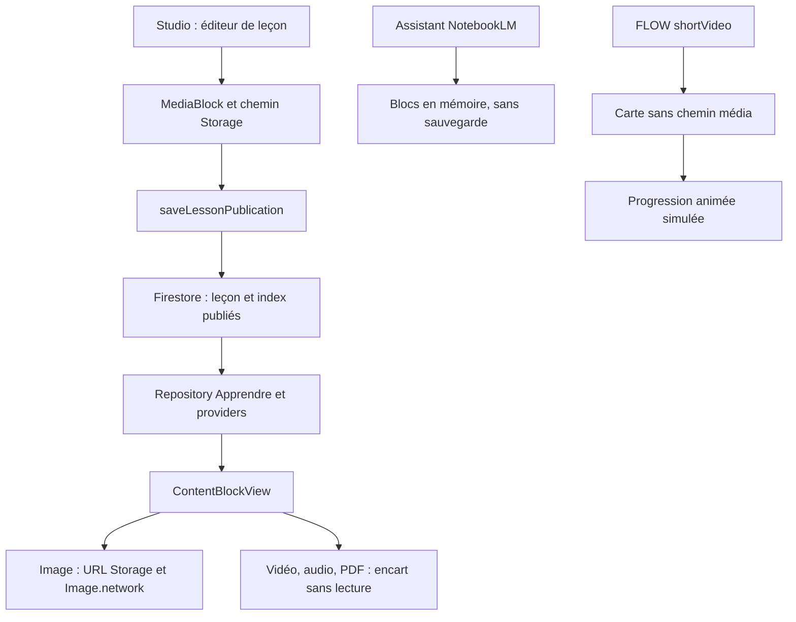

# Audit des animations INTELLIA Studio → backend → élève

**VERDICT : PARTIAL — 13 septembre 2026.** Projet vérifié : **edunova-aabd1**.

**Non : le pipeline actuel ne permet pas de publier une vidéo NotebookLM puis de la faire lire aux seules Terminales C et D sans mise à jour mobile.** Les modèles et le stockage existent, mais le lecteur vidéo élève, l’import NotebookLM persistant et le ciblage complet des séries manquent.

Une première mise à jour du lecteur générique est nécessaire. Ensuite, les nouvelles vidéos respectant les formats et le schéma pris en charge pourront être publiées sans nouvelle version mobile par contenu. Un nouveau moteur interactif pourra toujours nécessiter une mise à jour.

## 1. Périmètre et preuves

Audit en lecture seule du code applicatif, de Firestore, des métadonnées Storage, des règles déployées et des index. Aucun changement applicatif, déploiement, upload ou publication de test. Seuls ce rapport et les fichiers de travail d’audit ont été créés localement.

Le dépôt contient les modifications des interventions précédentes. L’audit porte sur son état actuel, pas sur une reconstruction certifiée du binaire installé sur chaque téléphone. Aucun MP4 NotebookLM réel n’a été fourni ; aucun test de décodage sur téléphone n’est revendiqué.

Le Studio identifié est intégré au projet **Flutter/Dart + Riverpod**. Le backend est en **TypeScript/Firebase Functions**. Aucun autre Studio web indépendant n’a été identifié dans ce dépôt.

Configuration vérifiée : `main_production.dart` → `AppConfig.production` → `DefaultFirebaseOptions` → **edunova-aabd1**, bucket **edunova-aabd1.firebasestorage.app**. `.firebaserc` confirme le projet production. Le staging déclaré est `intellia237-staging`, non utilisé pour ces lectures. `AppConfig` contrôle la cohérence entre flavor et environnement.

**Production**, inventaire commencé à 05 h 24, heure du Cameroun :

| Contrôle | Résultat |
|---|---|
| `classes/Terminale/subjects` | Deux matières publiées : `anglais` et `svteehb` (SVT) |
| `classes/terminale/subjects` | Aucun document ; la casse compte |
| Chimie / composés oxygénés | Non trouvés dans le catalogue Terminale et les leçons inventoriées |
| Groupe de collections `lessons` | 106 documents ; aucun `contentBlocks` non vide |
| `flow_items` | 8 documents : 7 publiés en Sixième, 1 brouillon en Cinquième ; aucune vidéo |
| `quizzes` | 4 documents |
| Groupes `resources`, `media`, `videos`, `animations`, `lesson_assets`, `attachments` | Aucun document retourné |
| Storage `educational_assets/` | Deux JPEG de pages de SVT Sixième ; aucune vidéo |
| Règles déployées | Identiques aux règles locales après normalisation des fins de ligne ; releases du 12 septembre |
| Index pédagogiques | Cinq index pertinents, tous `READY` |

Les requêtes Firestore étaient plafonnées à 2 000 documents par groupe ; aucun résultat n’atteint ce plafond. La liste Storage a été paginée. L’absence de vidéo concerne ce préfixe pédagogique, pas tous les buckets du compte.

## 2. Pipeline actuel exact



Le service d’upload est réellement utilisé par l’import de **pages PDF/images**. Cela ne rend pas fonctionnel l’import de vidéos NotebookLM.

## 3. Studio : capacités et ruptures

| Écran | Comportement vérifié |
|---|---|
| `admin_home_screen` / `content_studio_screen` | Studio à trois onglets : matières/cours, quiz, FLOW |
| `new_subject_dialog` | Classe, matière et séries autorisées ; création réservée au superadmin dans l’interface |
| `content_chapter_screen` | Création de chapitre, accès aux leçons, import de pages, suppressions administratives |
| `content_lesson_editor_screen` | Sections, mini-quiz, blocs V2, sauvegarde et publication serveur |
| `lesson_blocks_editor` | Choix texte/média/quiz/interactif ; image/audio/vidéo/PDF ; saisie manuelle du chemin Storage |
| `content_quiz_editor_screen` | Classes, séries, questions et corrections séparées |
| `flow_composer_screen` | Composition et chemin média ; aperçu basé sur le moteur actuel, sans player réel |
| `course_page_import_screen` | Sélecteur réel PDF/images, upload, appel `importCoursePages`, brouillons leçon/quiz/FLOW |
| `notebooklm_import_wizard_screen` | Assistant préparatoire incomplet ; aucun appelant trouvé dans `lib` |
| Écrans enseignant contenus/quiz | Ouvrent le Studio commun dans l’état actuel du dépôt |

**L’assistant NotebookLM ne crée pas réellement les brouillons.** `artifacts` est injecté au constructeur, vide par défaut ; aucun sélecteur n’alimente cette liste dans cet écran. `_import()` calcule les blocs et la provenance puis affiche « bloc(s) préparé(s) en brouillon ». Il n’appelle ni Storage, ni Firestore, ni une fonction de sauvegarde. Le chapitre saisi n’établit pas de relation persistée.

La politique reconnaît les fichiers vidéo/audio/image/PDF. Le JSON de quiz n’est pas converti sans schéma ; les blocs Markdown préparés ne lisent pas encore le texte du fichier. Aucun import fonctionnel de flashcards NotebookLM n’a été trouvé. Un commentaire du code sur les API Google n’est pas une preuve de leur disponibilité actuelle.

## 4. Backend : collections et contrats existants

Firestore n’impose pas un schéma global strict ; ce tableau décrit les modèles sérialisés et les lectures du code. Des documents historiques peuvent manquer de champs.

| Collection / chemin | Champs structurants |
|---|---|
| `classes/{classLevel}/subjects/{subjectId}` | `title`, `description`, `colorHex`, `iconKey`, `order`, `status`, `allowedSeries[]`, `chapterSummaries[]`, `updatedAt` |
| `…/chapters/{chapterId}` | `title`, `description`, `order`, `scope`, auteur, `lessonsCount`, `lessonPreviews[]`, `lessonCountsByScope` |
| `…/lessons/{lessonId}` | `classLevel`, `subjectId`, `chapterId`, `title`, `summary`, `estimatedMinutes`, `order`, `status`, `scope`, `origin`, auteur/dates, `schemaVersion`, `contentSections[]`, `contentBlocks[]`, `miniQuiz[]`, `editorialWorkflow` |
| `quizzes/{quizId}` | `subjectId`, `subjectLabel`, `classLevels[]`, `series[]`, `status`, `scope`, `mode`, `questions[]`, `sourceLessonId` éventuel |
| `quiz_answer_keys/{quizId}` | `answers[]` : corrigés utilisés par le serveur ; projection publique séparée |
| `flow_items/{id}` | `type`, `title`, `hook`, `subjectId`, `classLevels[]`, `scope`, `ref`, `payload`, `status`, `priority`, `publishedAt`, `scheduledAt`, durée, difficulté, tags, auteur, version |
| `lesson_assets/{id}` | Ancien chemin d’écriture du repository enseignant ; pas de lecture par Apprendre identifiée ; vide en production |
| `student_profiles/{uid}/lessonProgress/{…}` | Progression, pas les fichiers médias |

**MediaBlock existe déjà.** Champs : `id`, `type=media`, `order`, `mediaType`, `storagePath` ; optionnels `downloadUrl`, `caption`, `durationSeconds`, `fileSizeBytes`, `mimeType`, `transcriptionText`, `transcriptionVtt`. `mediaType` vaut `image`, `audio`, `video` ou `pdf`. Le renderer actuel n’utilise pas `downloadUrl` : pour les images, il résout `storagePath`.

Autres blocs : `text` (`markdown`, `title`), `quiz` (`quizId`, `inlineQuestions`), `interactive` (`componentType`, `parameters`, `assetDependencies`, `minAppVersion`). Il n’est pas nécessaire de créer une collection `resources` parallèle pour la première vidéo.

**Chemin canonique :**

```text
educational_assets/{scopeId}/{classLevel}/{subjectId}/{lessonId}/{assetId}/{fileName}
```

`scopeId=global` pour le programme commun, sinon identifiant d’établissement.

| Nature | MIME acceptés | Limite exacte |
|---|---|---:|
| Image | JPEG, PNG, WebP | 10 × 1 024² octets |
| Audio | `audio/mpeg`, `audio/mp4`, `audio/m4a`, `audio/aac` | 50 × 1 024² octets |
| Vidéo | `video/mp4`, `video/webm` | 150 × 1 024² octets |
| PDF | `application/pdf` | 25 × 1 024² octets |

GIF, Lottie JSON et Rive ne figurent pas dans les formats médias autorisés. Le contrôle de MIME n’est pas un contrôle du codec ou du contenu binaire. Aucun transcodage ou calcul de vignette vidéo n’a été trouvé dans ce circuit.

Fonctions pertinentes : `saveLessonPublication`, `createCatalogChapter`, `deleteCatalogContent`, `listEditorialFlow`, `importCoursePages`, `listPublishedQuizzes`, `getPublishedQuiz`, `checkTrainingQuizAnswer`, `submitQuizAttempt`, `submitFlowActivity`, `recordLessonProgress`.

**Publication insuffisamment validée pour les médias :** `saveLessonPublication` accepte `contentBlocks` comme tableau d’objets libres. Une liste non vide peut suffire à publier, sans vérifier fichier Storage, codec ni renderer. Elle actualise leçon, index, matière et compagnons ; cela ne prouve pas que chaque média est lisible.

## 5. Application élève et ciblage C/D

Apprendre : `learnHubProvider` → `subjectDetailProvider` → `chapterDetailProvider` → `lessonDetailProvider` → `FirestoreLearnRepository` → `LearnLesson.effectiveBlocks` → `LessonViewerScreen` → `ContentBlockView`.

FLOW : `flowCatalogProvider` → `FirestoreFlowFeedRepository` → `FlowItemMapper` → `FlowCardView`. Quiz : `quiz_providers` et `firestore_quiz_repository` appellent les fonctions de projection et correction.

| Capacité | État réel |
|---|---|
| URL distante | `getDownloadURL()` présent, image rendue par `Image.network` |
| Vidéo MP4/WebM | Types et stockage acceptés ; aucun player vidéo ni dépendance `video_player` |
| Audio | `just_audio` et `AudioOverviewPlayer` présents ; player isolé, aucun appel trouvé depuis les leçons ; bloc audio = encart |
| PDF | Import pages réel ; affichage élève = encart sans lecteur |
| Infographie | Image possible via `MediaBlock.image` ; type FLOW `infographic` rendu en texte/points |
| Image FLOW | Transformée en anecdote textuelle, chemin non transmis au renderer |
| Vidéo/audio FLOW | `FlowVideoCard` ne porte pas le chemin média ; progression par `AnimationController`, lecture simulée |
| Quiz | Hub et mini-quiz opérationnels ; `QuizBlock` V2 = encart sans navigation/interaction |
| Flashcards | Cartes FLOW question/réponse ; pas d’import de paquet NotebookLM |
| GIF / Lottie / Rive | Pas de pipeline autorisé GIF, pas de runtime Lottie/Rive identifié |
| Animations natives | Composants compilés, animations conceptuelles FLOW et registre Pythagore ; pas de chargement arbitraire d’une animation Chimie |

**Ciblage :** le niveau canonique est **`Terminale`**, pas `terminale`. `subjects.allowedSeries=[C,D]` filtre la liste des matières selon `student_profiles.series`. Les détails reçoivent `series` mais ne l’appliquent pas systématiquement ; `fetchLesson` contrôle statut et établissement, pas la série du parent.

Les leçons/blocs n’ont pas de ciblage C/D autonome consommé par le lecteur. FLOW n’a ni `series` ni `language` dans son modèle. Il filtre classe, statut, disponibilité et établissement côté client.

Les quiz filtrent `series[]` lors de la liste selon la valeur demandée ; l’autorisation commune des accès directs vérifie classe/établissement, pas la série du profil. Les quiz dérivés de publication reçoivent actuellement `series: []`. `language` est une entrée de génération des pages, pas un filtre unifié de distribution.

**Propagation :** les index sont actualisés dans la transaction de publication. `learnCatalogRevisionProvider` observe les matières et invalide le repository ; délai réseau variable, aucun SLA dans le code. Le cache mémoire a un TTL de cinq minutes. FLOW utilise des lectures ponctuelles et des invalidations, pas un abonnement direct permanent à `flow_items`. Une carte indépendante peut nécessiter un rechargement. Un appareil hors ligne ou une ancienne version ne sont pas garantis actualisés immédiatement.

## 6. Cache et hors ligne

Un bouton de préparation du chapitre existe déjà. `OfflineLearningActions.saveChapter` charge les leçons, puis stocke un manifeste SharedPreferences. Il s’appuie sur le cache des documents Firestore, sans télécharger les fichiers Storage. Retirer le chapitre supprime le manifeste, sans purge ciblée des documents Firestore.

FLOW met en cache du JSON, isolé par utilisateur/établissement/classe par l’appelant. `AudioMemoryStore` conserve position et vitesse, pas les octets audio. `Image.network` bénéficie du cache image du moteur, pas d’un gestionnaire de fichiers pédagogiques persistants.

**Préparer une leçon hors ligne ne garantit pas ses médias hors ligne.** Réutiliser le bouton existant, mais compléter : taille annoncée, inventaire des fichiers, téléchargement disque, fichier temporaire puis validation, checksum/version, reprise si plages HTTP disponibles, préférence Wi-Fi, quota, suppression et états par média. Lire le fichier validé, sinon proposer la lecture réseau. Tester en mode avion après redémarrage. Ne pas annoncer « disponible hors ligne » tant que les médias requis ne sont pas présents.

## 7. Sécurité

Les règles déployées correspondent aux règles locales auditées.

**Présent :** Storage non publiquement inscriptible, compte authentifié et actif, dépôt global superadmin, médias d’établissement réservés en écriture à son personnel ; limites taille/MIME ; élèves sans écriture des contenus pédagogiques. Une URL de téléchargement ne donne pas les droits d’écriture. Aucun secret serveur/clé privée identifié dans la recherche `lib`/`assets` ; les identifiants Firebase client ne constituent pas une autorité d’administration. Ce n’est pas un audit de tout l’historique Git.

**Écarts importants :**

1. Les règles de matières/chapitres/leçons autorisent la lecture directe à tout compte authentifié, sans garantir statut publié, classe, série et établissement. Le masquage UI ne protège pas les brouillons contre un client modifié.
2. Les fichiers Storage globaux sont lisibles par les comptes authentifiés sans vérifier le statut de la leçon : pas de séparation des brouillons médias.
3. `mayWriteLegacyCatalog` accepte tout enseignant, sans périmètre, notamment pour chapitres et quiz. Les écritures enseignantes des `quiz_answer_keys` ne vérifient pas non plus le rattachement au quiz.
4. `isAllowedEditorialTransition` lit `workflow.status`, alors que les usages actifs emploient `status` ou `editorialWorkflow.status`. Le contrôle éditorial ne couvre pas correctement tous les documents ; des écritures directes restent possibles.
5. FLOW publié est directement lisible par tout compte authentifié, sans restriction de série/établissement dans cette branche des règles. Les contrôles du repository et des points ne rendent pas cette lecture confidentielle.
6. Les URLs de téléchargement sont partageables ; le code ne produit pas d’URL courte durée après autorisation pédagogique. Pour du contenu privé, utiliser une lecture authentifiée ou une URL temporaire après contrôle d’audience.

Ce sont des conclusions de lecture des règles, pas des exploitations réalisées sur les comptes élèves. Aucune autorisation n’a été modifiée pendant cet audit.

## 8. Index

Déclarés et vérifiés `READY` : sujets `status/order`, leçons `status/order`, quiz `status/classLevels`, FLOW `status/classLevels/priority/publishedAt/__name__`, FLOW éditorial `classLevels/updatedAt`.

Aucun index vidéo particulier n’est nécessaire pour lire les blocs incorporés à une leçon. Le blocage actuel n’est pas un index absent. Pour un futur filtre classe+série, éviter deux champs tableaux dans un même index composite : une clé d’audience dénormalisée dans un seul tableau, ou un filtrage serveur après requête plus large, est à étudier selon le contrat final.

## 9. Architecture minimale proposée — non implémentée

Réutiliser `ContentBlock/MediaBlock`, les leçons et les chemins Storage. Partager le renderer entre aperçu Studio, Apprendre et FLOW.

```text
Export NotebookLM → sélection et validation Studio → upload Storage
→ MediaBlock dans une leçon draft → contrôles serveur
→ publication et index → lecteur générique élève
```

| Couche | Travail nécessaire |
|---|---|
| Studio | Relier l’assistant ; sélectionner les fichiers/octets ; choisir les vraies références ; upload et aperçu réel ; sauvegarde persistante et erreurs explicites |
| Backend/Firestore | Schéma strict par bloc, existence média, audience commune, héritage C/D vers quiz/FLOW, publication après disponibilité du fichier |
| Storage | Réutiliser chemin actuel, contrôler codec/durée réels, protéger brouillons, fichiers immuables par version, vignette et nettoyage des uploads abandonnés |
| Mobile | Player vidéo générique, attente/erreur/retry, pause hors écran, seek/plein écran, référence média conservée dans FLOW, audio existant relié, PDF et quiz liés complétés |
| Règles | Autorisation commune serveur/accès directs ; fermer les exceptions historiques en conservant les usages légitimes |
| Index | Ajouter uniquement ceux requis par les requêtes d’audience choisies |

Normalisation possible sans nouveau modèle concurrent : `image/infographic → media.image`, `video/animation vidéo → media.video`, `audio → media.audio`, `pdf → media.pdf`, `quiz → QuizBlock/quizId`, `flashcards → cartes question-réponse`. **FLOW est un canal, pas un codec.** Une animation interactive doit préciser un moteur/version supportés ; aucun JSON ne doit être interprété arbitrairement comme code.

Le parseur actuel rabat un type inconnu sur texte, et un `mediaType` inconnu sur image. Pour un contrat extensible, prévoir un vrai bloc inconnu avec repli lisible et validation stricte ; ne pas compter seulement sur le fallback du widget.

## 10. Formats recommandés

**Choix : MP4, vidéo H.264, audio AAC**, optimisé pour démarrer avant téléchargement complet. Cette recommandation repose sur le support Android et le chemin réseau/fichier du lecteur Flutter officiel. [Android](https://developer.android.com/media/platform/supported-formats?hl=en), [Flutter vidéo](https://docs.flutter.dev/cookbook/plugins/play-video).

| Format | Android / fluidité | Taille, réseau, hors ligne | NotebookLM / intégration |
|---|---|---|---|
| MP4 H.264/AAC | Très adapté ; décodage matériel courant | Compression adaptée aux capsules narrées ; fichier local après téléchargement | Format cible le plus simple ; contrôler le fichier réellement exporté |
| WebM VP8/VP9 | Support selon versions/appareils, navigateur à tester | Bonne compression possible, résultat dépend de l’encodage ; fichier local possible | Accepté par la politique actuelle ; export NotebookLM WebM non établi ; secondaire |
| GIF | Raster animé sans audio | Souvent lourd sur une séquence longue ; peu adapté à un cours narré | Refusé par la politique actuelle ; export non établi ; déconseillé ici |
| Lottie JSON | Runtime dédié, animations vectorielles compatibles | Compact pour dessins simples ; taille variable avec images/effets | Export NotebookLM non établi ; création dans un autre outil compatible ; runtime absent |
| Rive .riv | Runtime dédié, animation/interactivité | Peut être compact ; performances dépendantes de la scène ; cache fichier/assets | Export NotebookLM non établi ; création distincte ; runtime absent |

Lottie lit des animations exportées en JSON par des outils compatibles ; ce n’est pas une conversion automatique de vidéo en vecteurs. Rive dispose d’un runtime Flutter et de chargements URL, sans être intégré ici. [Lottie](https://github.com/airbnb/lottie-android), [Rive](https://rive.app/docs/runtimes/flutter/flutter).

Google confirme le téléchargement d’un fichier Video Overview. La page consultée ne garantit pas un codec immuable ou un export Lottie/Rive : vérifier extension, MIME et pistes du fichier. Aucun connecteur automatique NotebookLM n’a été trouvé dans le dépôt. [Documentation Google](https://support.google.com/gemininotebook/answer/16454555?hl=en).

Proposition à mesurer : 720p, 24–30 images/s, vidéo 0,8–1,5 Mbit/s, voix AAC 64–96 kbit/s ; option 480p seulement si les schémas restent lisibles. À 1 Mbit/s total, cinq minutes représentent environ **37,5 Mo** (calcul débit × durée, pas mesure d’un export). Le plafond 150 Mio n’est pas une recommandation de poids. Pour le démarrage progressif MP4, l’index du fichier doit précéder les données vidéo. Éviter l’autoplay sur connexion mesurée.

## 11. Exemple concret adapté au schéma existant

**Exemple documentaire non enregistré.** Le modèle existe : aucune nouvelle collection n’est créée. Utiliser les véritables identifiants générés par le Studio, pas un identifiant Chimie supposé.

Chemin : `classes/Terminale/subjects/{subjectId}/chapters/{chapterId}/lessons/{lessonId}`. Matière parente : `title=Chimie`, `allowedSeries=[C,D]`. Chapitre : « Propriétés chimiques et synthèse des composés oxygénés ».

```json
{
  "classLevel": "Terminale",
  "subjectId": "<subjectId>",
  "chapterId": "<chapterId>",
  "title": "Synthèse des composés oxygénés",
  "summary": "Vidéo et explication de la synthèse.",
  "estimatedMinutes": 5,
  "order": 0,
  "status": "draft",
  "scope": { "type": "global" },
  "schemaVersion": 2,
  "contentSections": [
    { "title": "Objectif", "body": "Comprendre les transformations présentées." }
  ],
  "contentBlocks": [
    {
      "id": "introduction", "type": "text", "order": 0,
      "title": "Objectif", "markdown": "Comprendre les transformations présentées."
    },
    {
      "id": "capsule", "type": "media", "order": 1,
      "mediaType": "video",
      "storagePath": "educational_assets/global/Terminale/<subjectId>/<lessonId>/<assetId>/synthese.mp4",
      "mimeType": "video/mp4",
      "caption": "Synthèse des composés oxygénés"
    }
  ],
  "miniQuiz": []
}
```

Remplacer les segments entre chevrons ; ajouter taille et durée uniquement après mesure, auteur et provenance réels. La publication passe par `saveLessonPublication`, qui écrit `status=published` et les index. Ne pas les fabriquer à la main.

**Aujourd’hui ce document n’afficherait qu’un encart vidéo.** Il décrit les données à réutiliser après ajout du lecteur. Le filtre C/D du parent ne suffit pas à corriger FLOW et les accès directs.

Emplacement recommandé : **Apprendre → Chimie → chapitre → leçon**, puis FLOW réutilisant le même fichier. Une rubrique Ressources autonome n’est pas requise pour démarrer.

## 12. Plan en phases et fichiers impactés

**Phase 1 — Vidéo distante minimale.** Import persistant, aperçu et lecteur MP4 partagés, référence média FLOW, audience C/D cohérente, validation serveur et règles. Première mise à jour mobile obligatoire. Estimation : **18–24 fichiers applicatifs/configuration**, plus **6–8 fichiers de tests**, selon la mutualisation. Principales zones : assistant/éditeur/service upload, modèle bloc et FLOW, player et vues, repositories/providers, fonction de publication, règles et dépendances/index.

Acceptation : lecture réelle avec seek/pause/retour ; visible pour C et D, refus pour A/TI et autre classe ; draft inaccessible via API et lecture directe ; réseau lent, fichier absent, révocation et actualisation. Essai staging avec un vrai export, sans chapitre Chimie codé en dur.

**Phase 2 — Infographie/PDF/audio et hors ligne.** Relier image/audio existants, ajouter lecteur PDF ; téléchargement volontaire, tailles, quota, reprise, suppression et mode avion. **8–12 fichiers supplémentaires ou repris**, plus tests.

**Phase 3 — NotebookLM complet.** Import partiel reprenable, checksums/dédoublonnage, provenance, conversions explicites quiz/flashcards à partir d’exports réels, aperçu élève et validation pédagogique. **8–14 fichiers supplémentaires ou repris**, plus tests. L’import manuel de fichiers ne nécessite pas une API NotebookLM. Les fourchettes se recouvrent : ne pas les additionner comme un décompte certain.

Risques : anciens mobiles, coût data, mémoire d’un upload Uint8List volumineux, schémas illisibles après compression, fichiers orphelins, publication avant upload fini, permissions trop larges, audience incohérente, cache de métadonnées sans médias, confusion entre simulation UI et lecture réelle.

## 13. Vérifications et réponse finale

**67 tests existants réussis** : politique NotebookLM, assistant, médias, registre interactif, rendu/édition des blocs. Ils attestent les contrats actuels, pas un pipeline vidéo. Un test attend précisément une capsule audio annoncée sans téléchargement ; le test du wizard vérifie un message de brouillon, pas une écriture Firebase.

Aucun « TEST ANIMATION PIPELINE » créé : l’essai optionnel supposait un pipeline fonctionnel, et aucune vidéo réelle n’a été fournie. Les ruptures sont établies par le code sans polluer la production.

**Réponse : non aujourd’hui ; oui après une première mise à jour du pipeline et du lecteur, puis sans mise à jour par nouvelle vidéo compatible.** Stocker et publier les métadonnées d’un MP4 est possible ; sa lecture réelle et sa distribution correcte aux seules Terminales C/D ne constituent pas encore un parcours complet.

## Sources locales — chemins exacts

- [lib/main_production.dart](</C:/projets/FlutterProjects/Intellia237/lib/main_production.dart>).
- [lib/app/config/app_config.dart](</C:/projets/FlutterProjects/Intellia237/lib/app/config/app_config.dart>).
- [lib/firebase_options.dart](</C:/projets/FlutterProjects/Intellia237/lib/firebase_options.dart>).
- [lib/features/admin/presentation/admin_home_screen.dart](</C:/projets/FlutterProjects/Intellia237/lib/features/admin/presentation/admin_home_screen.dart>).
- [lib/features/admin/presentation/content_studio_screen.dart](</C:/projets/FlutterProjects/Intellia237/lib/features/admin/presentation/content_studio_screen.dart>).
- [lib/features/admin/presentation/new_subject_dialog.dart](</C:/projets/FlutterProjects/Intellia237/lib/features/admin/presentation/new_subject_dialog.dart>).
- [lib/features/admin/presentation/content_chapter_screen.dart](</C:/projets/FlutterProjects/Intellia237/lib/features/admin/presentation/content_chapter_screen.dart>).
- [lib/features/admin/presentation/content_lesson_editor_screen.dart](</C:/projets/FlutterProjects/Intellia237/lib/features/admin/presentation/content_lesson_editor_screen.dart>).
- [lib/features/admin/presentation/widgets/lesson_blocks_editor.dart](</C:/projets/FlutterProjects/Intellia237/lib/features/admin/presentation/widgets/lesson_blocks_editor.dart>).
- [lib/features/admin/presentation/content_quiz_editor_screen.dart](</C:/projets/FlutterProjects/Intellia237/lib/features/admin/presentation/content_quiz_editor_screen.dart>).
- [lib/features/admin/presentation/flow_composer_screen.dart](</C:/projets/FlutterProjects/Intellia237/lib/features/admin/presentation/flow_composer_screen.dart>).
- [lib/features/admin/presentation/notebooklm_import_wizard_screen.dart](</C:/projets/FlutterProjects/Intellia237/lib/features/admin/presentation/notebooklm_import_wizard_screen.dart>).
- [lib/features/admin/domain/notebooklm_import.dart](</C:/projets/FlutterProjects/Intellia237/lib/features/admin/domain/notebooklm_import.dart>).
- [lib/features/admin/domain/admin_content_models.dart](</C:/projets/FlutterProjects/Intellia237/lib/features/admin/domain/admin_content_models.dart>).
- [lib/features/admin/domain/educational_media.dart](</C:/projets/FlutterProjects/Intellia237/lib/features/admin/domain/educational_media.dart>).
- [lib/features/admin/data/educational_media_service.dart](</C:/projets/FlutterProjects/Intellia237/lib/features/admin/data/educational_media_service.dart>).
- [lib/features/admin/application/admin_content_providers.dart](</C:/projets/FlutterProjects/Intellia237/lib/features/admin/application/admin_content_providers.dart>).
- [lib/features/admin/application/flow_composer_providers.dart](</C:/projets/FlutterProjects/Intellia237/lib/features/admin/application/flow_composer_providers.dart>).
- [lib/features/admin/presentation/course_page_import_screen.dart](</C:/projets/FlutterProjects/Intellia237/lib/features/admin/presentation/course_page_import_screen.dart>).
- [lib/features/admin/data/course_page_import_service.dart](</C:/projets/FlutterProjects/Intellia237/lib/features/admin/data/course_page_import_service.dart>).
- [functions/src/services/coursePageImport.ts](</C:/projets/FlutterProjects/Intellia237/functions/src/services/coursePageImport.ts>).
- [functions/src/services/lessonPublicationCallable.ts](</C:/projets/FlutterProjects/Intellia237/functions/src/services/lessonPublicationCallable.ts>).
- [functions/src/services/quizContentStore.ts](</C:/projets/FlutterProjects/Intellia237/functions/src/services/quizContentStore.ts>).
- [functions/src/index.ts](</C:/projets/FlutterProjects/Intellia237/functions/src/index.ts>).
- [lib/features/learn/domain/content_block.dart](</C:/projets/FlutterProjects/Intellia237/lib/features/learn/domain/content_block.dart>).
- [lib/features/learn/domain/learn_lesson.dart](</C:/projets/FlutterProjects/Intellia237/lib/features/learn/domain/learn_lesson.dart>).
- [lib/features/learn/data/firestore_learn_repository.dart](</C:/projets/FlutterProjects/Intellia237/lib/features/learn/data/firestore_learn_repository.dart>).
- [lib/features/learn/application/learn_providers.dart](</C:/projets/FlutterProjects/Intellia237/lib/features/learn/application/learn_providers.dart>).
- [lib/features/learn/presentation/lesson_viewer_screen.dart](</C:/projets/FlutterProjects/Intellia237/lib/features/learn/presentation/lesson_viewer_screen.dart>).
- [lib/features/learn/presentation/widgets/content_block_view.dart](</C:/projets/FlutterProjects/Intellia237/lib/features/learn/presentation/widgets/content_block_view.dart>).
- [lib/features/learn/presentation/widgets/audio_overview_player.dart](</C:/projets/FlutterProjects/Intellia237/lib/features/learn/presentation/widgets/audio_overview_player.dart>).
- [lib/features/learn/presentation/widgets/interactive/interactive_block_view.dart](</C:/projets/FlutterProjects/Intellia237/lib/features/learn/presentation/widgets/interactive/interactive_block_view.dart>).
- [lib/features/learn/application/offline_learning_controller.dart](</C:/projets/FlutterProjects/Intellia237/lib/features/learn/application/offline_learning_controller.dart>).
- [lib/features/learn/data/offline_chapter_pack_store.dart](</C:/projets/FlutterProjects/Intellia237/lib/features/learn/data/offline_chapter_pack_store.dart>).
- [lib/features/learn/data/learn_catalog_cache.dart](</C:/projets/FlutterProjects/Intellia237/lib/features/learn/data/learn_catalog_cache.dart>).
- [lib/features/flow/domain/flow_item.dart](</C:/projets/FlutterProjects/Intellia237/lib/features/flow/domain/flow_item.dart>).
- [lib/features/flow/domain/flow_card.dart](</C:/projets/FlutterProjects/Intellia237/lib/features/flow/domain/flow_card.dart>).
- [lib/features/flow/domain/flow_item_mapper.dart](</C:/projets/FlutterProjects/Intellia237/lib/features/flow/domain/flow_item_mapper.dart>).
- [lib/features/flow/data/flow_feed_repository.dart](</C:/projets/FlutterProjects/Intellia237/lib/features/flow/data/flow_feed_repository.dart>).
- [lib/features/flow/application/flow_controller.dart](</C:/projets/FlutterProjects/Intellia237/lib/features/flow/application/flow_controller.dart>).
- [lib/features/flow/presentation/widgets/flow_content_card_views.dart](</C:/projets/FlutterProjects/Intellia237/lib/features/flow/presentation/widgets/flow_content_card_views.dart>).
- [lib/features/quiz/data/firestore_quiz_repository.dart](</C:/projets/FlutterProjects/Intellia237/lib/features/quiz/data/firestore_quiz_repository.dart>).
- [lib/features/quiz/application/quiz_providers.dart](</C:/projets/FlutterProjects/Intellia237/lib/features/quiz/application/quiz_providers.dart>).
- [firestore.rules](</C:/projets/FlutterProjects/Intellia237/firestore.rules>).
- [storage.rules](</C:/projets/FlutterProjects/Intellia237/storage.rules>).
- [firestore.indexes.json](</C:/projets/FlutterProjects/Intellia237/firestore.indexes.json>).
- [pubspec.yaml](</C:/projets/FlutterProjects/Intellia237/pubspec.yaml>).
- [.codex_function_audit/animation-live-summary.json](</C:/projets/FlutterProjects/Intellia237/.codex_function_audit/animation-live-summary.json>).
- [.codex_function_audit/animation-live-indexes.json](</C:/projets/FlutterProjects/Intellia237/.codex_function_audit/animation-live-indexes.json>).
- [.codex_function_audit/animation-audit-tests.log](</C:/projets/FlutterProjects/Intellia237/.codex_function_audit/animation-audit-tests.log>).
