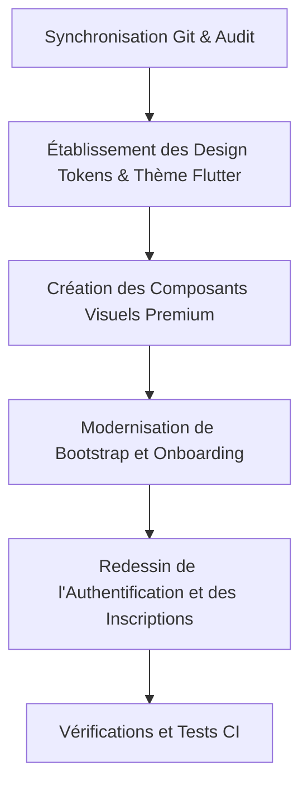

# Plan d'Implémentation de l'Audit Visuel & Direction Artistique (Phase 3A)

Ce document dresse l'état des lieux initial des composants visuels du projet mobile et définit le plan d'action pour la transition vers l'identité haut de gamme **INTELLIA237** (Cupertino Luxury × Material 3 Expressive).

---

## 1. Audit Visuel Initial

### A. Composants Existants à Conserver
* **Riverpod Providers & Controllers** : La logique d'état d'authentification (`AuthController`), d'onboarding (`markOnboardingSeen`), et d'inscription (`StudentRegistrationController`, `ParentRegistrationController`, etc.).
* **Routage** : Configuration `GoRouter` dans `lib/app/router/app_router.dart` et `app_routes.dart`.
* **Clean Architecture** : Organisation en répertoires par feature (`data`, `domain`, `presentation`).
* **Tests unitaires existants** : Tests d'intégration et de configuration à préserver.

### B. Composants à Remplacer / Moderniser
* **Écrans Directs** :
  * `BootstrapScreen` : Remplacer le fond sombre et les particules par un style clair premium.
  * `OnboardingScreen` : Refondre sous forme d'une Story premium interactive.
  * `LoginScreen`, `ForgotPasswordScreen` & `RegisterScreen` : Remplacer le fond bleu marine sombre et le style JewelCard sombre par un thème clair raffiné.
  * Coquilles d'inscription (`StudentRegistrationFlowScreen`, `ParentRegistrationScreen`, etc.) : Adapter au thème clair et intégrer des sélecteurs raffinés.
* **Tuteurs** :
  * Supprimer le catalogue des 6 tuteurs spécifiques par niveau scolaire (`TutorPersona.all`).
  * Mettre en place Kira et Léo comme uniques compagnons d'étude dans `TutorPersona`.

### C. Styles Obsolètes
* L'ancienne couleur de marque dominante bleu marine (`#1451E1` ou `#0B1F4A`) sur les écrans d'authentification et d'onboarding.
* Les rayons de bordure secs (`AppRadius` 12px/18px) qui doivent migrer vers des angles plus fluides de 16px (moyen) et 22px (large).
* Les formulaires à menus déroulants sombres (`_DarkDropdown`).

### D. Incohérences Visuelles
* Décalage profond entre l'expérience web (clair, blanc, violet, aéré, minimaliste) et l'expérience mobile actuelle (sombre, bleu marine, saturé, illustré avec des robots).
* Onboarding mobile actuel utilisant des photos lourdes (JPEG de 1 Mo chacune) avec des copies mentionnant "Tuteur IA" et "Intelligence artificielle" qui contreviennent aux chartes éditoriales d'Intellia237.

---

## 2. Inventaire des Assets

### A. Assets Officiels Utilisables
* `assets/branding/icon-512.png` : Source principale pour la génération des icônes de l'application.
* `assets/companions/kira.png` & `assets/companions/leo.png` : Illustrations officielles des compagnons (à utiliser dans l'onboarding et les avatars).
* Les logos de démarrage dans `assets/branding/`.

### B. Assets Insuffisants ou Obsolètes
* Les illustrations de robots ou textes mentionnant l'ancienne marque dans les Lottie animations ou slides.
* Les photos JPEG lourdes dans `assets/onboarding/` qui alourdissent l'application de plus de 3.5 Mo. Nous allons concevoir une interface Story élégante avec des arrière-plans gradients et l'intégration directe des illustrations Kira et Léo.

---

## 3. Direction Artistique & Palette (Tokens)

Les nouveaux design tokens seront centralisés dans `lib/app/theme/design_tokens.dart` sous les noms :
* **IntelliaColors** : brandIndigo (`#5856D6`), brandPurple (`#AF52DE`), brandBlue (`#007AFF`), backgrounds, surfaces claires, statuts.
* **IntelliaGradients** : Gradients pour les compagnons (Kira, Léo), matières, et boutons.
* **IntelliaTypography** : didot (pour les titres Didot via Playfair Display) et Montserrat (corps de texte).
* **IntelliaSpacing** : Échelle 4, 8, 12, 16, 24, 32, 40, 56.
* **IntelliaRadii** : small (10), medium (16), large (22), extraLarge (28), full (9999).
* **IntelliaShadows** : Ombres douces signature et ombre de marque.
* **IntelliaMotion** : Durées d'animations standardisées.

---

## 4. Plan de Composants Réutilisables (`lib/core/widgets/`)

Nous allons implémenter :
1. `IntelliaScaffold` : Gère le fond clair premium avec halos optionnels.
2. `IntelliaTopBar` : Barre de navigation supérieure transparente.
3. `IntelliaPressable` : Interaction tactile uniforme avec retour d'échelle (0.97) et haptique.
4. `IntelliaPrimaryButton` : Bouton gradient capsule premium (hauteur 52px).
5. `IntelliaGlassButton` : Bouton translucide avec flou d'arrière-plan.
6. `IntelliaOutlineButton` & `IntelliaTextButton`.
7. `IntelliaCard` & `IntelliaGlassCard` : Cartes supportant les 6 variantes demandées (quiet, solid, elevated, glass, gradient, outline).
8. `IntelliaCompanionAvatar` : Affichage de Kira et Léo avec halo de couleur.
9. `IntelliaTextField` & `IntelliaPasswordField` : Inputs raffinés à bordure fine pour formulaires clairs.

---

## 5. Gestion des Risques

### A. Risques de Performance
* **Glassmorphisme (BackdropFilter)** : Risque de ralentissement sur les smartphones Android d'entrée de gamme.
  * *Solution* : Limiter le flou aux overlays statiques ou contrôles uniques (dialogues, bottom sheets). Aucun flou sur des listes scrollables ou des animations complexes.
* **Rendu d'image** : Les compagnons Kira et Léo font près de 300 Ko chacun.
  * *Solution* : Précharger les images dans la mémoire de Flutter pendant le bootstrap réel de l'application via `precacheImage`.

### B. Risques d'Accessibilité (A11y)
* **Contraste** : L'utilisation de textes blancs sur des arrière-plans clairs ou gradients délicats peut nuire à la lisibilité.
  * *Solution* : Utiliser des overlays progressifs sombres (scrim) pour les textes blancs de l'onboarding, et privilégier des textes sombres (`#171529`) sur les fonds clairs.
* **Cibles tactiles** : Tous les éléments interactifs auront une dimension cliquable minimale de 48x48 px.
* **TalkBack / VoiceOver** : Ajout de métadonnées sémantiques explicites sur les boutons et images décoratives.

---

## 6. Plan d'Exécution

1. **Tokens & Thème** : Mettre en place `IntelliaColors`, `IntelliaTypography`, etc. Refactoriser `AppTheme` avec les composants globaux.
2. **Composants** : Développer et tester la bibliothèque de composants dans `lib/core/widgets/`.
3. **Bootstrap & Splash** : Configurer et générer les splash screens natifs et les icônes de l'application, puis adapter `BootstrapScreen`.
4. **Onboarding** : Refaire l'onboarding sous forme de Stories interactives avec progression automatique et gestion du focus (mise en pause en arrière-plan).
5. **Authentification** : Refondre `LoginScreen`, `ForgotPasswordScreen` et `RegisterScreen` dans un style clair premium, puis appliquer les styles aux formulaires d'inscriptions.
6. **Vérifications** : Exécuter l'analyse statique, les tests, et valider les builds de production et de staging.
